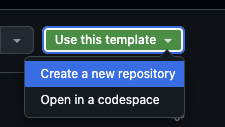

# React + TypeScript + Vite + Tailwind template

A simple and customizable starter template for building fast and modern web applications using React, TypeScript, Vite, and Tailwind CSS.

## How to Use This Template:

Click the "Use this template" button above to create your own repository based on this template.



### Install dependencies:

```bash
npm install
```

or

```bash
pnpm install
```

### Start developing:

```bash
npm run dev
```

or

```bash
pnpm dev
```

This template comes pre-configured with React, TypeScript, Vite, and Tailwind CSS to help you quickly bootstrap your project. Enjoy faster builds, a hot-reload development environment, and utility-first styling with Tailwind.
